# Distributor Operational Assessment — Panduan Pengguna

**Peran yang dibahas dalam panduan ini: Area Sales Supervisor**
(Peran lain — Distributor Manager, Admin RSA, Account Receivable — memiliki
antarmuka berbasis upload-massal yang berbeda dan didokumentasikan secara
terpisah.)

Dibuat secara otomatis dari penjelajahan screenshot aplikasi
(`docs_crawler.py`, Playwright) dengan login menggunakan akun `budi` /
Area Sales Supervisor. Screenshot tersimpan di folder `/screenshots`.

🇬🇧 *English version: [User_Guide.html](User_Guide.html) /
[User_Guide.md](User_Guide.md)*

---

## Daftar Isi

1. [Login](#1-login)
2. [Dashboard Setelah Login (Form Terkunci)](#2-dashboard-setelah-login-form-terkunci)
3. [Filter Periode Assessment](#3-filter-periode-assessment)
4. [Filter Distributor](#4-filter-distributor)
5. [Form Assessment — People & Roles](#5-form-assessment--people--roles)
6. [Form Assessment — Infrastructure & Delivery / Operations & Compliance](#6-form-assessment--infrastructure--delivery--operations--compliance)
7. [Live Score Tracker (Sidebar)](#7-live-score-tracker-sidebar)
8. [Review & Submit](#8-review--submit)
9. [Hasil Submission / Notifikasi Submission Ganda](#9-hasil-submission--notifikasi-submission-ganda)
10. [Ganti Password (Change Password)](#10-ganti-password-change-password)
11. [FAQ](#faq)
12. [Troubleshooting](#troubleshooting)

---

## 1. Login

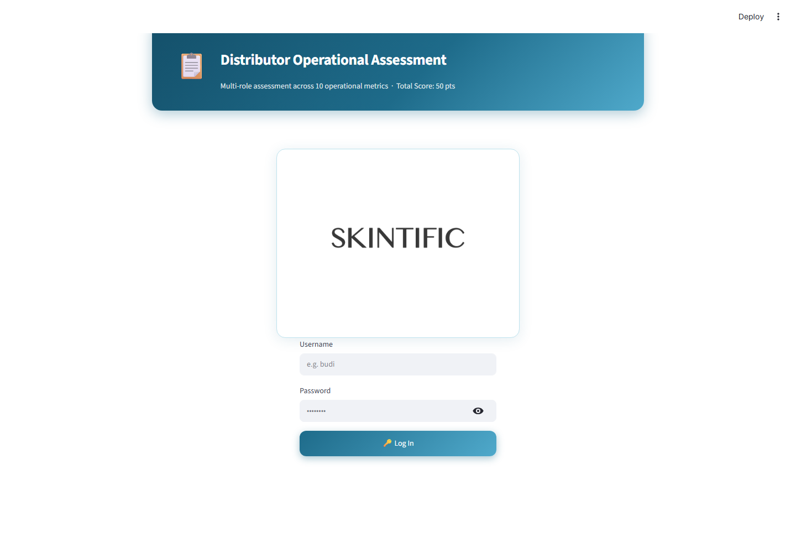
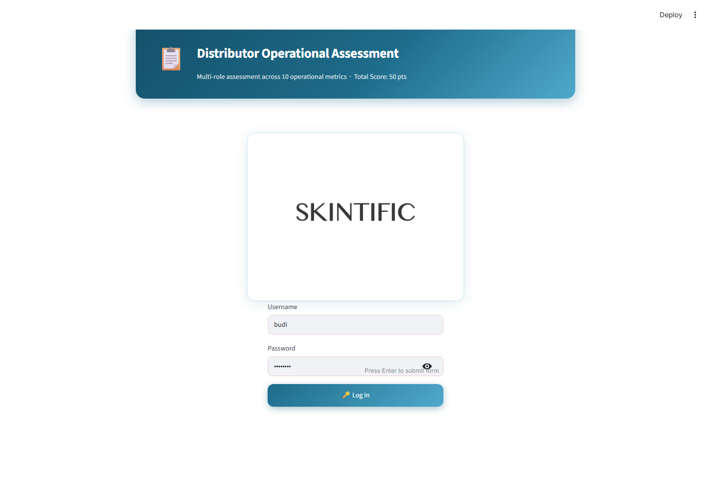

**Tujuan:** Melakukan autentikasi dan otomatis mengarahkan pengguna ke
antarmuka sesuai perannya — tidak ada pemilihan peran secara manual; akun
Anda yang menentukan tampilan yang akan muncul.

**Kolom isian:**
- **Username** — nama login yang sudah didaftarkan (tidak case-sensitive,
  huruf besar/kecil tidak masalah)
- **Password** — password akun Anda

**Tombol:**
- **🔑 Log In** — mengirimkan kredensial. Jika berhasil, halaman akan
  reload menuju dashboard sesuai peran Anda. Jika gagal, akan muncul
  pesan "❌ Invalid username or password." di bawah form tanpa
  menyebutkan kolom mana yang salah.

**Aturan validasi:**
- Perbandingan username tidak case-sensitive (`Budi`, `budi`, `BUDI`
  semuanya akan cocok ke akun yang sama).
- Tidak ada batasan lockout/percobaan ulang — tidak ada rate limiting
  untuk percobaan login.

**Aksi umum pengguna:** Ketik username dan password, klik Log In. Jika
lupa password, lihat [Bagian 10 — Ganti Password](#10-ganti-password-change-password)
(memerlukan password lama Anda) atau hubungi Admin untuk reset password
melalui panel Create User milik Distributor Manager.

---

## 2. Dashboard Setelah Login (Form Terkunci)

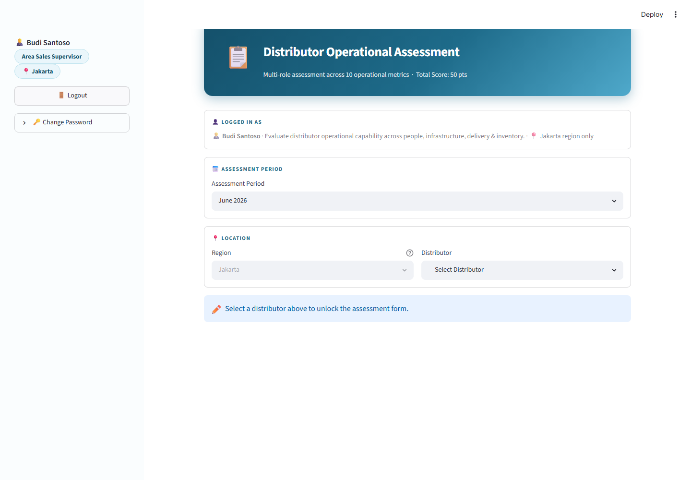

**Tujuan:** Mengonfirmasi identitas dan ruang lingkup peran/region Anda,
sebelum form assessment dibuka.

**Yang ditampilkan:**
- **Sidebar**: nama Anda, label peran, label region, tombol Logout,
  panel Change Password
- **Kartu "Logged In As"**: nama, deskripsi peran, dan ruang lingkup region
- **Kartu "Assessment Period"**: pemilih bulan/tahun
- **Kartu "Location"**: Region (terkunci sesuai region yang ditugaskan ke
  Anda) + Distributor (wajib dipilih)

**Aturan validasi:**
- Form assessment di bawah tetap tersembunyi sampai sebuah Distributor
  dipilih. Region tidak dapat diubah — akun Area Sales Supervisor hanya
  ditugaskan untuk satu region tertentu.

**Aksi umum pengguna:** Pilih Assessment Period, lalu pilih Distributor
untuk membuka form.

---

## 3. Filter Periode Assessment

**Tujuan:** Memilih bulan yang menjadi acuan assessment.

**Perilaku filter:**
- Area Sales Supervisor hanya bisa melihat **3 bulan**: bulan ini dan 2
  bulan sebelumnya. (Peran lain — peran bulk/admin — melihat jendela
  yang lebih luas, 13 bulan: 6 bulan ke belakang sampai 6 bulan ke
  depan.) Ini disengaja: assessment lapangan diharapkan diisi tepat
  waktu, bukan jauh-jauh hari sebelumnya atau lama setelah kejadian.
- Default-nya adalah bulan berjalan saat halaman dibuka.

**Aksi umum pengguna:** Buka dropdown, pilih bulan. Mengubah periode
setelah Anda mulai mengisi form tidak akan menghapus jawaban yang sudah
diisi, tapi mengubah periode setelah submission untuk satu periode akan
memungkinkan Anda memulai submission baru untuk periode lain (hanya satu
submission diperbolehkan per peran+distributor+periode — lihat Bagian 8).

---

## 4. Filter Distributor

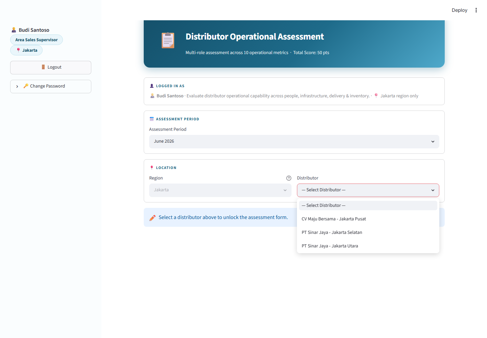

**Tujuan:** Memilih distributor yang akan diases.

**Perilaku filter:**
- Daftar hanya menampilkan distributor yang ditugaskan **khusus untuk
  Anda** (dicocokkan pada master distributor berdasarkan region dan nama
  Anda sebagai supervisor yang bertanggung jawab) — bukan semua
  distributor di region Anda.
- Jika daftar kosong, berarti belum ada distributor yang ditugaskan ke
  Anda; hubungi Admin.

**Aturan validasi:** Assessment Period dan Distributor harus diisi
sebelum form di bawah muncul — akan tampil banner "✏️ Select a
distributor above to unlock the assessment form" sampai keduanya diisi.

---

## 5. Form Assessment — People & Roles

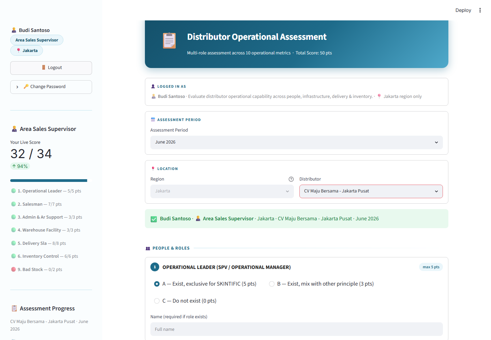
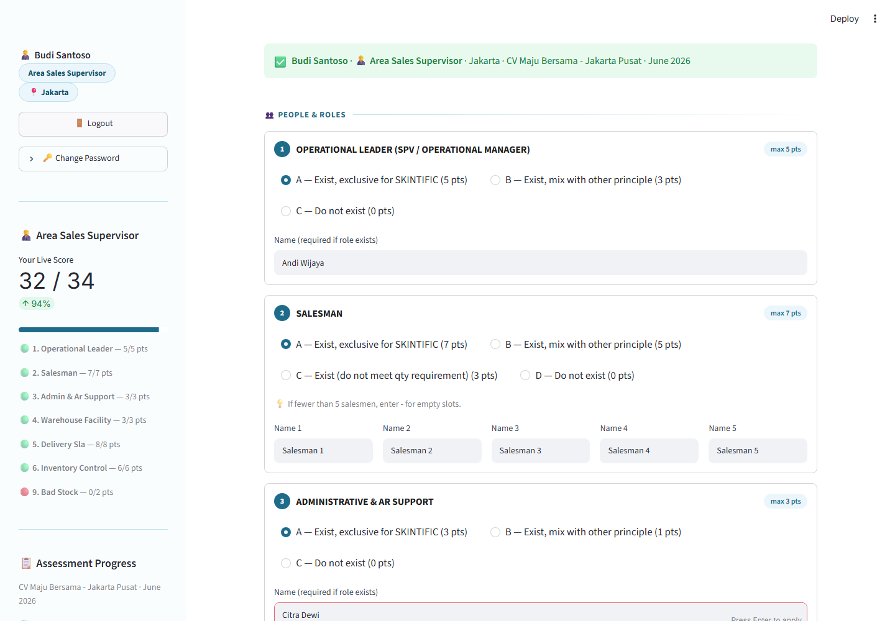

**Tujuan:** Kategori metrik pertama dari 3 kategori. Menilai apakah
distributor memiliki staf khusus (exclusive untuk SKINTIFIC) di 3 peran
berikut.

**Kartu pada kategori ini:**
| # | Metrik | Poin Maksimal | Grade |
|---|---|---|---|
| 1 | Operational Leader (SPV/Operational Manager) | 5 | A=Exclusive(5), B=Mixed(3), C=Tidak ada(0) |
| 2 | Salesman | 7 | A=Exclusive(7), B=Mixed(5), C=Di bawah kuota(3), D=Tidak ada(0) |
| 3 | Administrative & AR Support | 3 | A=Exclusive(3), B=Mixed(1), C=Tidak ada(0) |

**Tombol/input:**
- Radio button (A/B/C/D) untuk memilih grade setiap metrik
- Kolom nama — wajib diisi jika grade yang dipilih menunjukkan peran
  tersebut ada; Salesman wajib diisi **tepat 5 nama** (gunakan `-` untuk
  slot yang tidak terisi jika kurang dari 5 salesman)

**Aturan validasi:**
- Jika grade = "Do not exist" (tidak ada), nama yang sudah diisi akan
  ditolak ("selected 'Do not exist' but a name was entered")
- Jika grade ≠ "Do not exist", nama wajib diisi
- Salesman secara khusus wajib memiliki tepat 5 entri nama (nama asli
  atau placeholder `-`), tidak boleh lebih atau kurang

**Kalkulasi yang ditampilkan:** Belum ada di tahap ini — poin dihitung
secara live di sidebar (lihat Bagian 7).

---

## 6. Form Assessment — Infrastructure & Delivery / Operations & Compliance

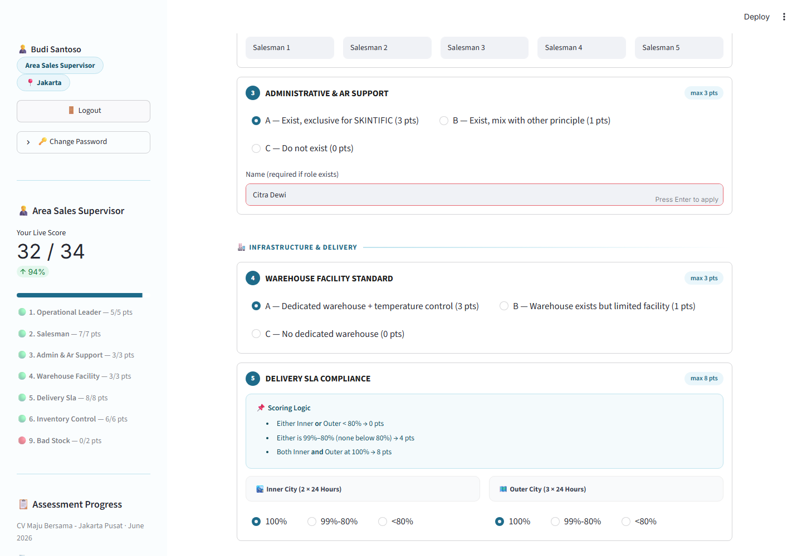
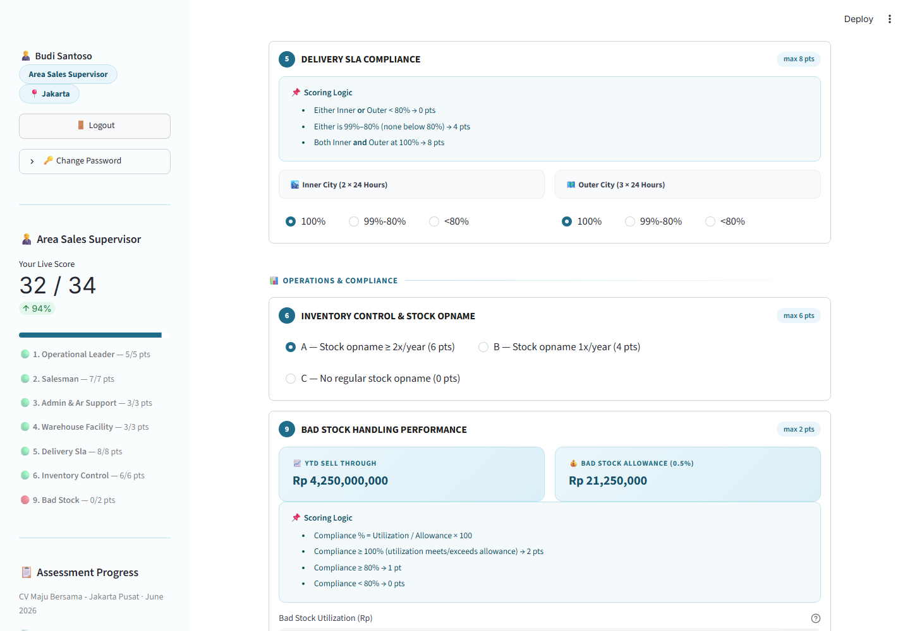
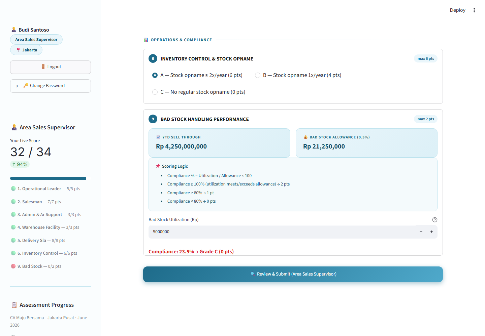

**Tujuan:** 4 metrik tersisa yang menjadi tanggung jawab Area Sales
Supervisor.

| # | Metrik | Poin Maksimal | Catatan |
|---|---|---|---|
| 4 | Warehouse Facility Standard | 3 | Pilih grade langsung |
| 5 | Delivery SLA Compliance | 8 | **Dihitung otomatis**, lihat di bawah |
| 6 | Inventory Control & Stock Opname | 6 | Pilih grade langsung |
| 9 | Bad Stock Handling Performance | 2 | **Dihitung otomatis**, lihat di bawah |

### Delivery SLA Compliance — cara perhitungan
Dua input radio terpisah (Inner City 2×24 jam, Outer City 3×24 jam),
masing-masing 100% / 99%-80% / <80%. Grade **dihitung otomatis**, bukan
dipilih langsung:
- Inner ATAU Outer di bawah 80% → **0 pts**
- Salah satu di 99%-80% (tidak ada yang di bawah 80%) → **4 pts**
- Inner DAN Outer di 100% → **8 pts**

### Bad Stock Handling Performance — cara perhitungan
1. **YTD Sell Through** dicari otomatis untuk distributor dan tahun yang
   dipilih (hanya brand Skintific + Timephoria).
2. **Bad Stock Allowance** = 0.5% dari YTD Sell Through.
3. Anda mengisi **Bad Stock Utilization (Rp)** — nilai Rupiah aktual bad
   stock yang diklaim pada periode ini.
4. **Compliance % = Utilization ÷ Allowance × 100**, dibatasi maksimal
   100%.
5. Grade: ≥100% → A (2 pts), ≥80% → B (1 pt), <80% → C (0 pts).

**Aturan validasi (penting):** Jika distributor memiliki **YTD sell
through nol atau tidak ada datanya**, seluruh kartu ini akan
**disembunyikan** dan metrik ini otomatis mendapat skor maksimal (2 pts)
— karena tidak ada data untuk dibandingkan, jadi tidak ada input yang
ditampilkan dan tidak ada error yang muncul.

**Aksi umum pengguna:** Pilih grade langsung untuk Warehouse dan
Inventory; untuk Delivery SLA, pilih band inner/outer; untuk Bad Stock,
isi nominal Rupiah utilization dan lihat compliance % serta grade
ter-update secara live.

---

## 7. Live Score Tracker (Sidebar)

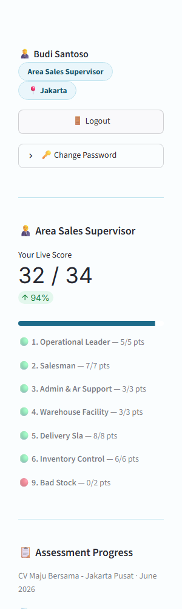

**Tujuan:** Memberikan feedback skor secara real-time saat Anda mengisi
form, sekaligus visibilitas progress 3 peran lain untuk
distributor+periode yang sama.

**Yang ditampilkan:**
- **"Your Live Score"** — total berjalan dari maksimal 34 (maksimal
  7 metrik milik Area Sales Supervisor), ter-update setiap ada perubahan
  jawaban, dilengkapi progress bar
- Rincian per metrik dengan titik warna: 🟢 nilai penuh, 🟡 sebagian,
  🔴 nol
- **"Assessment Progress"** — semua 10 metrik dari 4 peran untuk
  distributor+periode ini: ✅ selesai (dengan poin + peran mana yang
  submit) atau ⏳ belum (dengan peran mana yang bertanggung jawab)
- **"Combined Score So Far"** — dari maksimal 50, gabungan dari peran
  yang sudah submit

**Kalkulasi yang ditampilkan:** Ini hanya cermin live dari aturan
scoring yang sama seperti dijelaskan di Bagian 5–6 — tidak ada
kalkulasi baru di sini, hanya total berjalan dari jawaban di atas.

---

## 8. Review & Submit

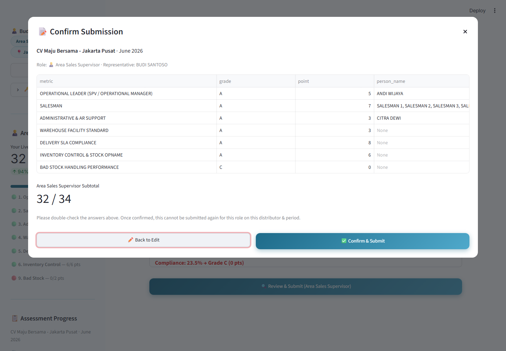

**Tujuan:** Langkah pengecekan ulang wajib sebelum data tersimpan.

**Tombol:**
- **🔍 Review & Submit (Area Sales Supervisor)** — memvalidasi form
  (lihat aturan validasi di Bagian 5) dan, jika valid, membuka popup
  konfirmasi seperti gambar di atas. Tombol ini nonaktif jika Anda
  sudah pernah submit untuk distributor+periode ini.
- Di dalam popup: **✏️ Back to Edit** (menutup popup, tidak ada
  perubahan tersimpan) atau **✅ Confirm & Submit** (menyimpan
  submission)

**Yang ditampilkan di popup:** Setiap metrik, grade-nya, nilai poin,
dan nama orang (jika ada), beserta subtotal Anda dari maksimal 34.

**Aturan validasi:**
- Semua aturan validasi level-field di Bagian 5 dicek terlebih dahulu;
  error akan ditampilkan dan popup tidak akan terbuka sampai semua
  diperbaiki.
- **Satu submission per peran, per distributor, per periode
  assessment** — setelah dikonfirmasi, Anda tidak bisa submit ulang
  untuk kombinasi yang sama persis. Jika mencoba mengakses kembali,
  akan muncul banner peringatan dan tombol Review & Submit akan
  nonaktif.

---

## 9. Hasil Submission / Notifikasi Submission Ganda

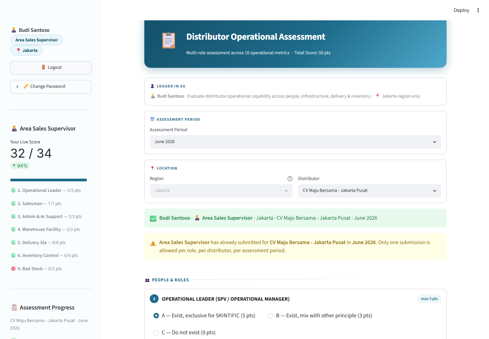

**Tujuan:** Mengonfirmasi bahwa submission berhasil disimpan, dan — jika
keempat peran sudah submit bagian masing-masing — menampilkan skor
gabungan akhir dan rating (Excellent/Good/Fair/Needs Improvement) untuk
distributor+periode tersebut.

**Jika Anda kembali ke distributor+periode yang sudah pernah disubmit:**
banner kuning akan muncul bertuliskan *"[Role] has already submitted
for [Distributor] in [Period]. Only one submission is allowed per role,
per distributor, per assessment period."* — ini adalah aturan satu
submission yang sama dari Bagian 8, ditampilkan kembali saat Anda
mengunjungi ulang.

---

## 10. Ganti Password (Change Password)

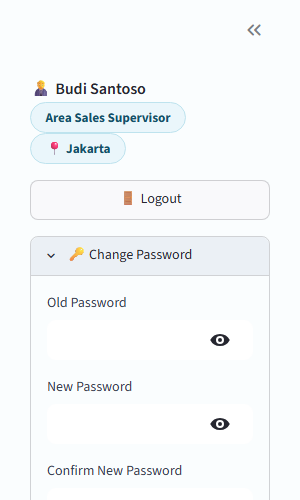

**Tujuan:** Penggantian password secara mandiri (self-service), tersedia
untuk semua peran (bukan hanya Area Sales Supervisor).

**Kolom isian:** Old Password, New Password, Confirm New Password
(semuanya tersembunyi/masked, dengan ikon mata untuk
menampilkan/menyembunyikan).

**Tombol:** **Update Password** — memvalidasi dan menerapkan perubahan.

**Aturan validasi:**
- Ketiga kolom wajib diisi.
- Old Password harus cocok persis dengan password Anda saat ini.
- New Password dan Confirm New Password harus sama.
- Tidak ada aturan kompleksitas password (panjang minimal, karakter
  khusus, dll) yang diterapkan.
- Jika berhasil, Anda akan **langsung logout** dan harus login kembali
  dengan password baru — ini disengaja, bukan bug.

---

## FAQ

**T: Saya tidak menemukan distributor yang seharusnya saya lihat.**
J: Daftar distributor Anda difilter hanya menampilkan distributor yang
ditugaskan ke Anda. Jika ada yang hilang, hubungi Admin untuk mengecek
mapping-nya.

**T: Kartu Bad Stock tiba-tiba hilang — apakah ini bug?**
J: Tidak. Kartu ini hanya hilang ketika distributor memiliki YTD sell
through nol (Skintific + Timephoria) untuk tahun yang dipilih — tidak
ada data untuk menghitung compliance, sehingga metrik ini otomatis
diberi nilai penuh dan input-nya disembunyikan.

**T: Saya salah input setelah konfirmasi — bisa diperbaiki?**
J: Tidak. Submission bersifat final per peran/distributor/periode.
Hubungi Admin jika memang perlu koreksi.

**T: Mengapa sidebar menampilkan progress peran lain?**
J: Keempat peran digabung menjadi satu assessment per
distributor+periode — sidebar memungkinkan Anda melihat keseluruhan
gambaran, bukan hanya bagian Anda sendiri.

## Troubleshooting

| Gejala | Kemungkinan Sebab | Solusi |
|---|---|---|
| "Invalid username or password" | Salah ketik, atau akun salah | Cek kembali kredensial; username tidak case-sensitive tapi password case-sensitive |
| Dropdown distributor kosong | Tidak ada distributor yang ditugaskan ke akun Anda | Hubungi Admin |
| Tombol Review & Submit nonaktif/abu-abu | Sudah pernah submit untuk distributor+periode ini | Pilih distributor atau periode lain, atau hubungi Admin untuk koreksi |
| Kartu Bad Stock hilang | YTD sell through nol untuk distributor/tahun tersebut | Perilaku normal, bukan error — lihat FAQ |
| Logout tiba-tiba | Anda baru saja mengganti password | Login kembali dengan password baru |
